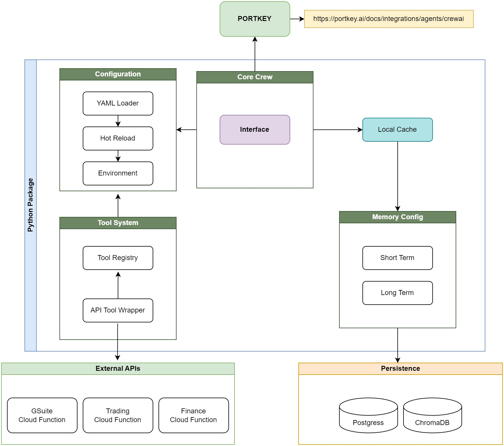

# Cognition Core

Core integration package for building AI agents with CrewAI, providing configuration management, memory systems, and tool integration.

## Architecture

```
cognition-core/
├── config/                  # Configuration files
│   ├── agents.yaml         # Agent definitions
│   ├── crew.yaml          # Crew settings
│   ├── memory.yaml        # Memory configuration
│   ├── portkey.yaml       # LLM routing
│   ├── tasks.yaml         # Task definitions
│   └── tools.yaml         # Tool configuration
├── memory/                 # Memory implementations
│   ├── entity.py          # Entity memory
│   ├── long_term.py       # Long-term storage
│   ├── short_term.py      # Short-term memory
│   ├── storage.py         # Storage interfaces
│   └── mem_svc.py         # Memory service
├── tools/                  # Tool management
│   ├── custom_tool.py     # Custom tool base
│   ├── tool_svc.py        # Tool service
│   └── __init__.py
└── crew.py                # Core crew base class
```

## Features

### Configuration Management
- Hot-reloading YAML configuration
- Environment variable integration
- Centralized settings management

### Memory Systems
- Short-term memory (Redis)
- Long-term memory (Firestore)
- Entity memory for relationship tracking
- Configurable storage backends

### Tool Integration
- Dynamic tool loading from API endpoints
- In-memory tool registry via ToolService
- Configuration-driven tool management
- Automatic parameter validation with Pydantic
- Configurable caching per tool
- Dynamic tool refresh capability with thread safety
- Improved error handling for failed services
- Configurable HTTP client timeouts
- Environment variable support in tool headers
- Atomic tool updates with rollback on failure

### LLM Integration
- Portkey routing and monitoring 
- Multi-model support
- Performance optimization

## Installation

```bash
pip install cognition-core
```

## Environment Variables

Required:
- `CONFIG_DIR`: Configuration directory path (default: src/cognition-core/config)
- `CONFIG_RELOAD_TIMEOUT`: Timeout for config reload (default: 0.1)
- `LONG_TERM_DB_PASSWORD`: Password for long-term memory database
- `CHROMA_PASSWORD`: Password for short-term memory database
- `PORTKEY_VIRTUAL_KEY`: Portkey virtual key for LLM routing
- `PORTKEY_API_KEY`: Portkey API key for LLM routing
- `APP_LOG_LEVEL`: Logging level (default: "INFO")

## Tool Service Usage

The ToolService now supports dynamic tool refreshing:

```python
from cognition_core.tools import ToolService

# Initialize service
tool_service = ToolService()
await tool_service.initialize()

# Get tools
calculator = tool_service.get_tool("calculator")
available_tools = tool_service.list_tools()

# Refresh tools at runtime
await tool_service.refresh_tools()  # Thread-safe refresh
```

### Tool Configuration

```yaml
# tools.yaml
tool_services:
  - name: "primary_service"
    enabled: true
    base_url: "http://localhost:8080/api/v1"
    endpoints:
      - path: "/tools"
        method: "GET"
    headers:
      Authorization: "${TOOL_SERVICE_API_KEY}"

settings:
  cache:
    enabled: true
    ttl: 3600
  validation:
    response_timeout: 30
```

### Error Handling
- Failed services are tracked and skipped in subsequent operations
- Atomic tool updates prevent partial states
- Existing tools are preserved on refresh failure
- Detailed error logging with service context

## Quick Start

```python
from cognition_core import CognitionCoreCrewBase
from cognition_core.tools import ToolService
from crewai import Agent, Task, Crew

class YourCrew(CognitionCoreCrewBase):
    def __init__(self):
        super().__init__()
        self.tool_service = ToolService()
        
    async def setup(self):
        await self.tool_service.initialize()  # Loads tools into memory
        
    @agent
    def researcher(self) -> Agent:
        return Agent(
            config=self.agents_config["researcher"],
            tools=[self.tool_service.get_tool("calculator")],  # Get specific tool
            llm=self.init_portkey_llm(
                model="gpt-4",
                portkey_config=self.portkey_config
            ),
            verbose=True
        )

    @crew
    def crew(self) -> Crew:
        return Crew(
            agents=self.agents,
            tasks=self.tasks,
            process=Process.sequential,
            memory=True,
            verbose=True
        )
```

## Configuration

Example YAML configurations:

```yaml
# memory.yaml
short_term_memory:
  enabled: true
  external: true
  host: "redis.example.com"
  port: 6379

long_term_memory:
  enabled: true
  external: true
  connection_string: "${LONG_TERM_DB_CONNECTION_STRING}"
```

```yaml
# tools.yaml
version: "1.0"
environment: "development"

# Tool Service Configuration
tool_services:
  - name: "primary_service"
    enabled: true
    base_url: "http://localhost:8080/api/v1"
    endpoints:
      - path: "/tools"
        method: "GET"
        description: "Fetches available tools"
      - path: "/tools/{tool_id}"
        method: "GET"
        description: "Fetches specific tool details"
    headers:
      Authorization: "${TOOL_SERVICE_API_KEY}"

# Global Tool Settings
settings:
  cache:
    enabled: true
    ttl: 3600  # Cache TTL in seconds
    max_size: 1000  # Maximum number of cached results

  validation:
    schema_validation: true
    response_timeout: 30
```

## Tool Service Usage

The ToolService manages dynamic tool loading and access:

```python
from cognition_core.tools import ToolService

# Initialize service
tool_service = ToolService()
await tool_service.initialize()  # Loads tools from configured endpoints

# Access tools
calculator = tool_service.get_tool("calculator")  # Get specific tool
available_tools = tool_service.list_tools()  # List all tools

# Tools remain in memory for the lifetime of the ToolService instance
```

## Contributing

1. Fork the repository
2. Create a feature branch
3. Submit a pull request with tests

## License

MIT